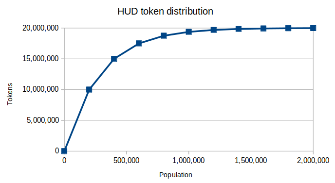

[本文件的中文翻译](./ADDITIONAL_RULES_ZH.md) | [Traducción de este documento al español](./ADDITIONAL_RULES_ES.md)

#  Humanity Unchained DAO

The source code and technical documentation is in the **[app directory](./app)**.

<!-- TOC -->

- [Humanity Unchained DAO](#humanity-unchained-dao)
    - [Introduction](#introduction)
- [Additional Rules](#additional-rules)
    - [General](#general)
    - [App](#app)
        - [General](#general)
        - [Identity Management System](#identity-management-system)
        - [Assembly](#assembly)
            - [Members](#members)
            - [Delegates](#delegates)
            - [Seats](#seats)
        - [Voting](#voting)
            - [General](#general)
            - [Off-chain](#off-chain)
            - [On-chain](#on-chain)
                - [Quorum](#quorum)
        - [Guidemother](#guidemother)
        - [Wallet](#wallet)
        - [Token](#token)
            - [Distribution](#distribution)
        - [Emblems](#emblems)
            - [Clusters](#clusters)
    - [Management of off-chain services](#management-of-off-chain-services)
    - [Infringement of the Rules](#infringement-of-the-rules)
    - [Additional Rules amedment procedure](#additional-rules-amedment-procedure)

<!-- /TOC -->

## Introduction

We are [Humanity Unchained DAO](https://humanityunchained.org) (or **HUD** for short), a [Decentralized Autonomous Organization (DAO)](https://en.wikipedia.org/wiki/Decentralized_autonomous_organization) and alternative to the governance monopoly imposed globally through states, transnational institutions and technolgy overlords that enslaves humanity.

We are building a new civilization based on the principle of unconditional respect for the consent of human beings. Under this principle, any system of government, such as constitutions and laws, monetary policies, justice systems, electoral systems, supranational treaties, religious organizations, etc. is ilegitimate *as long as* the human beings under the mandate of the system had not given their [consent](./constitution/CONSTITUTION.md#article-2) to abide by the rules of the system.

In contrast, HUD members voluntarily promise to uphold the [Constitution](./constitution) and the [Additional Rules](#additional-rules) (this very document). These two documents lay the foundation to build a new framework for coexistence that allows human beings to create and choose the systems of government, in the form of a federation of DAOs, that they want to live under. These DAOs may be diverse in purpose, internal rules, and in the way they are organized socially, economically, etc. They may also share resources in the physical world, such as territories.

In the case of dispute among members and/or DAOs, a trial by jury may be held by all HUD members or, optionally, their appointed delegates, whose ruling must be abode, esentially functioning as a [semi-direct democracy](https://en.wikipedia.org/wiki/Semi-direct_democracy) on the [blockchain](https://en.wikipedia.org/wiki/Blockchain). In addition, this voting system allows HUD to interact with other [smart contracts](https://en.wikipedia.org/wiki/Smart_contract) on-chain to, for example, collectively manage the DAO's finances or to update its smart contract code according to the latest version of the [Additional Rules](#additional-rules) approved democratically by the DAO.

To ensure the 1-human-1-vote principle, HUD uses the identity registration system [Proof of Humanity](https://proofofhumanity.id/)that proves that all members are living human beings and that there are no duplicate identities. Optionally, members can create an anonymous identity derived from their non-anonymous [Proof of Humanity](https://proofofhumanity.id/) identity using the zero-knowledge proof cryptography from [SISMO](https://sismo.io).

The jury's ruling may be enforced through fines, revoking roles or banning members. HUD has two types of tokens: a [fungible token](#token) (the HUD token), which is used to fuel HUD's economy, and a special type of [Non-Fungible Token](https://en.wikipedia.org/wiki/Non-fungible_token) called [emblem](#emblems), which is used to appoint roles. Emblems whose usage is linked to one or more territories are called [clusters](#clusters). HUD has full control over these tokens, and may even confiscate them if the jury determines so.

HUD's [Constitution](./constitution) [cannot be changed](./constitution/CONSTITUTION.md#article-6), which allows individuals and DAOs joining HUD benefit from HUD's perpetual constitutional guarantee of the unconditional respect for the consent of human beings and the ability to request a trial by jury in the case of a dispute. Individuals can join HUD by simply registering their identity and signing a promise to uphold the [Constitution](./constitution) and the [Additional Rules](#additional-rules) with the digital wallet associated to their identity. DAOs can integrate with HUD by assigning emblems to their users and making them required to be held to belong to the community or to perform internal roles. For critical roles that require placing trust in a third party, the emblem holder must deposit HUD tokens as collateral.

# Additional Rules

## General

### Art. 1 
The DAO shall be called Humanity Unchained DAO.

### Art. 2
The DAO's logo will be a simplified figure of two human forms embracing.

### Art. 3
The primary official language of the DAO shall be English.

### Art. 4
The secondary official languages of the DAO shall be Mandarin Chinese and Spanish.

### Art. 5
Translations of the original sources in the primary language to the secondary languages may be used for the Constitution, the Additional Rules and the user interface of the application, to the extent possible. In the event of any discrepancy between the different language versions, the primary official language version shall always prevail.

### Art. 6
Jury's judgments shall prevail over specifications. Specifications shall prevail over the code.

## App

### General

#### Art. 1
There shall be an app which implements the requirements established in the Constitution and the Additional Rules.

#### Art. 2
The app should be implemented using a technology that is publicly accesible, secure, verifiable and tamper-proof. The DAO may decide whether or not to upgrade the app to use more advanced technologies as the state-of-the-art of decentralized technologies evolves.

#### Art. 3
The app shall be distributed under the MIT license.

#### Art. 5
The app shall be a Web3 app built on Ethereum smart contracts and be deployed on the Polygon blockchain.

#### Art. 6
The smart contracts shall be modifiable only by the DAO.

#### Art. 7
The smart contract addresses shall be resolved from the [Ethereum Name Service](https://ens.domains/).

### Identity Management System

#### Art. 1
The app shall provide a way for members to create and manage their digital identity through an Identity Management System.

#### Art. 2
The Identity Management System shall be [sybil attack](https://en.wikipedia.org/wiki/Sybil_attack) resistant.

#### Art. 3
It shall be possible to integrate other identity systems with the app.

#### Art. 4
Members may register one non-anonymous HUD identity and one anonymous HUD identity, and freely choose which one to use anytime.

#### Art. 5
The app shall support [Proof of Humanity](https://proofofhumanity.id/) as non-anonymous identity system. A system shall be created to sync the Proof of Humanity smart contract on the Ethereum mainnet to Polygon chain.

#### Art. 6
The app shall support [SISMO](https://sismo.io)'s [Proof of Humanity](https://proofofhumanity.id/) badge as anonymous identity system.

#### Art. 7
Identity's metadata shall be stored on [IPFS](https://en.wikipedia.org/wiki/InterPlanetary_File_System).

#### Art. 8
The default IPFS gateway shall be [nftstorage.link](https://nftstorage.link).

### Assembly

#### Members

##### Art. 1
All members of the DAO must possess a valid registered identity on the Identity Management System.

##### Art. 2
In order to become a member, applicants shall sign with their wallets a promise to uphold the [constitution](./constitution/CONSTITUTION) and the current and future versions of the Additional Rules for the duration of their membership.

##### Art. 3
Members may cancel their membership at anytime.

#### Delegates

##### Art. 1
Members may appoint a delegate, who shall cast votes on behalf of the members.

##### Art. 2
Delegates shall not require being members.

#### Seats

##### Art. 1
There shall be 20 seats.

##### Art. 2
Delegates with the most number of appointed members may take a seat.

### Voting

#### General

##### Art. 1
The way to count votes shall be 1-human-1-vote.

##### Art. 2
There shall be two types of votes: member votes and delegate votes.

##### Art. 3
The vote sign can be "Yes", "No" and "Blank".

##### Art. 4
Votings on proposals that require on-chain transactions shall be done on-chain. The rest of proposals may be voted off-chain.

##### Art. 5
Distrusted addresses shall not be allowed to vote.

#### Off-chain

###### Art. 1
It shall be possible to carry out votings off-chain on [Snapshot](snapshot.org).

#### On-chain

###### Art. 1
The app shall implement an on-chain voting system that allows members of the DAO to collectively interact with any smart contract running on the same chain. The system shall support the submission of proposals containing transactions which shall be executed if a majority of the members so approve.

###### Art. 2
Anyone except for distrusted addresses may submit proposals.

###### Art. 3
Proposals may contain any number of transactions. 

###### Art. 4
It shall be possible to attach metadata to proposals and transactions.

###### Art. 5
Only members may initiate votings on the submitted proposals.

###### Art. 6
The creation of votings shall be free of charge.

###### Art. 7
Every voting shall be divided into two: a voting by the delegates and a voting by the members. If the results of votings are in conflict (e.g. the delegates approve the proposal and members do not approve, or vice versa), then the member's always overrides the delegate's. Furthermore, the voting by the members shall always finish after the voting by the delegates.

###### Art. 8
Voting by the delegates: The proposal shall be approved by the delegates of the DAO if the sum of all delegate votes of seated delegates who voted "yes" is greater than the total number of members who appointed a seated delegated multiplied by a certain threshold.

Example:

Delegate D1 (seated) represents members M1 and M2.
Delegate D2 (seated) represents members M3 and M4.
Delegate D3 (seated) represents member M5.
Delegate D4 (non-seated) represents member M6.
Threshold: 50%.

D1 and D4 vote "no".
D2 and D3 vote "yes".

Total number of members who appointed a seated delegated: 5.
Delegated "yes" votes: 2 + 1 = 3.

3 > 5 * 50% => The proposal is approved by the delegates.

###### Art. 9
Voting by the members: The proposal shall be approved or rejected by the members of the DAO if the number of members who voted "yes" or the number of members votes who voted "no", respectively, is larger than the total number of members multiplied by a certain theshold.

Example:

Members: M1, M2, M3, M4, M5 and M6.

M1, M2, M3 and M4 vote "no".
M5 votes "sí".
M6 votes "blank".
Threshold: 50%.

4 > 6 * 50% => The proposal is rejected by the members.

###### Art. 10
The DAO can set the value of the voting thresholds, or otherwise it shall be 50% by default.

###### Art. 11
The transactions of approved proposals may be executed by anyone.

###### Art. 12
Transaction executors may be rewarded with HUD tokens.

###### Art. 13
Seated delegates who have abstained from voting on the last voting shall be distrusted.
Members who have abstained from voting on the last two votings and have not appointed a delegate shall be distrusted.

###### Art. 14
Votings shall start on Monday 00:00 CET and shall end on Saturday 23:59 CET of the same week.

##### Quorum

###### Art. 1
A minimum number of registered members (also known as *Member Quorum*) is needed for a proposal to executed if approved. Until the Quorum is reached, only the [Guidemother](#guidemother) shall be able to execute approved proposals.

###### Art. 2
The quorum shall be at least 1000 members.

### Guidemother

#### Art. 1
Until the [quorum](#quorum) has been reached, the guidemother may be able modify or re-deploy the smart contracts, but for the sole purposes of fixing bugs or to lower the number of quorum members required.

#### Art. 2
The guidemother shall be removed automatically once the [quorum](#quorum) has been reached.

### Wallet

#### Art. 1
The DAO shall own a wallet to store any kind of token on the chain.

#### Art. 2
Transfers out of the wallet may be possible only through an on-chain voting approved by the DAO.

### Token

#### Art. 1
DAO shall have a fungible token, which will be called *HUD token*.

#### Art. 2
The token shall implement the [ERC-777 standard](https://eips.ethereum.org/EIPS/eip-777).

#### Art. 3
The token shall have the following features:

Symbol: HUD
Name: Humanity Unchained DAO
Decimals: 18

#### Art. 4
The DAO shall have full control of the token, such as the ability to mint, destroy, seize and forcibly transfer tokens, and to prevent specific addresses to receive or send tokens.

#### Art. 5
The total token supply shall be 21 million.

#### Art. 6
The DAO shall own an initial reserve of 1 million HUD tokens. The DAO shall decide what to do with the reserve through on-chain votings.

#### [Distribution](#distribution)

##### Art. 1
Every new member who has been referred by another member shall be eligible for a reward in HUD tokens. Members may only be referred once.

##### Art. 2
Members who refer new members shall be eligible for a reward in HUD tokens per each new referred member. Members may refer to an unlimited amount of new members.

##### Art. 3
The sum of the HUD tokens to be rewarded to the referrer member and to the referred member shall not surpass the amount given by the following formula:

50 / (2 ^ floor(memberCount / 200000))

that is:

| Member range           | Number of HUD tokens |
|------------------------|----------------------|
| x < 200000             | 50                   |
| 200000 <= x < 400000   | 25                   |
| 400000 <= x < 600000   | 12.5                 |
| 600000 <= x < 800000   | 6.25                 |
|  ...                   | ...                  |

and so on until the total limit of tokens rewarded is reached.

##### Art. 4
The total number of rewarded HUD tokens shall no surpass 20 million.

### Emblems

Note: In this section, the term "DAO" is used to refer either to the organization in general or to any smart contract of to the app.

#### Art. 1
The app shall implement a special type of non-fungible token, called *Emblem*, that provides the DAO with a flexible way to build and manage organizational structures.

#### Art. 2
The Emblems implementation shall follow the [ERC-1155 Multi Token Standard](https://eips.ethereum.org/EIPS/eip-1155).

#### Art. 3
Anyone shall be able to create an emblem and to do it for free, unless the DAO assigns a fee for the creation of new emblems or for the minting of tokens of a particular emblem. Such fee shall be charged in HUD tokens.

#### Art. 4
The emblem's creator shall have the emblem's admin role by default. Such role mat be transferred to another address by the DAO and the admin itself.

#### Art. 5
The emblem's URI, where the token's metadata is stored, shall be changed by the DAO only. Should the emblem's admin or holders want to change the URI, a proposal shall be submitted to the DAO for on-chain voting.

#### Art. 6
The DAO or the emblem's admin may set a mandatory deposit in HUD tokens required to hold the emblem. Addresses who do not deposit the amount shall not be able to receive emblem's tokens. If the address already holds tokens, the holder shall not be able to make use of the tokens until the full required amount is deposited.

#### Art. 7
Emblems may be non-transferable (also known as *soulbound*), meaning that the owner cannot transfer them out to another address, unless the owner is the emblem's admin or the DAO. This feature is set upon the emblem's creation and only the DAO can change it.

#### Art. 8
Accounts may or may not own more than one token of a specific emblem unless the owner is the emblem's admin or the DAO. This feature is set upon the emblem's creation and only the DAO can change it.

#### Art. 9
The DAO and the admin can forcefully transfer emblem tokens from any address except from a DAO's. This includes destroying tokens (which effectively is equivalent to transfer them to the zero address).

#### Art. 10
Emblems may be *verified*, which means that they are legitimized by the DAO. The DAO may curate an emblem through on-chain voting. Emblems created by the DAO shall be curated by default. 

#### Art. 11
The DAO's members, delegates and seats shall be emblems, whose admin is the DAO, they shall be non-transferable and each address may only own one token.

#### Art. 12
The membership emblem's minting fee and deposit required shall be zero.

#### Art. 13
The delegate's emblem minting fee shall be zero. The deposit required shall be 100 HUD tokens.

#### Art. 14
The seat's emblem minting fee shall be zero. The deposit required shall be 200 HUD tokens.

#### Art. 15
The DAO shall have full control of the emblem tokens, such as the ability to mint, destroy and forcibly transfer tokens, and to prevent specific addresses to receive or send tokens.

#### Art. 16
It shall be possible to integrate emblems in other DAOs, such as e.g. those created using [Aragon](https://aragon.org).

#### Clusters

##### Art. 1
A special type of emblem that is linked to one or more territories shall be called a "cluster". The spatial coordinates of the territories will be stored as part of the token metadata.

##### Art. 2
Clusters' territories shall be represented graphically in a map on the app.

## Management of off-chain services

### Art. 1
The DAO shall appoint members to be responsible for managing off-chain services through the creation and transfer of emblems created for such purpose. Such emblems shall be referred as *admin emblems*.

### Art. 2
An admin emblem shall be created for each of the following external services:

| Service | URI |
| --- | --- |
| Web domain and server | https://humanityunchained.org |
| Subgraph | https://api.thegraph.com/subgraphs/name/hhh01398/hud-subgraph-test-1
| ENS | humanityunchaineddao.eth |
| Github | https://github.com/hhh01398/hud2 |
| Twitter | https://twitter.com/UnchainedDAO |
| Telegram | https://t.me/humanityunchaineddao |
| Forum | https://forum.humanityunchained.org |

### Art. 3
Admin emblems shall be transferable only by the DAO.

### Art. 4
A member may only hold one admin emblem for each off-chain service.

### Art. 5
A deposit of 5000 HUD tokens is needed to hold an admin emblem.

### Art. 6
The emblem holders shall not be distrusted members.

### Art. 7
The Guidemother shall handover the credentials of any off-chain service in her possesion to the corresponding emblem holders before the Quorum is reached.

## Infringement of the Rules

#### Art. 1
The App shall provide a way for the DAO to keep a record of expelled members.

#### Art. 2
The App shall provide a way for the DAO to keep a record of addresses who have been reprimanded for breaching any rules. Such addresses shall be referred as *distrusted*.

#### Art. 3
The DAO may set what addresses are distrust through an on-chain voting for any reason the DAO deems appropriate.

#### Art. 4
Distrusted members may be expelled.

#### Art. 5
Distrusted addresses may be trusted back by the DAO through an on-chain voting.

#### Art. 6
Distrusted addresses shall be unable to receive or send HUD tokens or emblems.

#### Art. 7
Distrusted addresses or ex-members may not become members or delegates.

#### Art. 8
Distrusted delegates cannot claim a seat. Distrusted seated delegates can keep their seats.

#### Art. 9
Distrusted addresses shall not be able to submit proposals or start votings.

#### Art. 10
Seated delegates shall be automatically distrusted if they abstain to vote in the latest on-chain voting.

#### Art. 11
Members shall be automatically distrusted if they abstain in the two latest on-chain votings and have no appointed delegate.

#### Art. 12
Distrusted addresses may not be emblem administrators.

## Additional Rules amedment procedure

### Art. 1
The Additional Rules document shall be version-controlled.

### Art. 2
New versions of the Additional Rules document shall effectively come into force once the DAO smart contract is updated through an on-chain voting with the reference (e.g. an URI to a specific Git commit) to the new Additional Rules document.