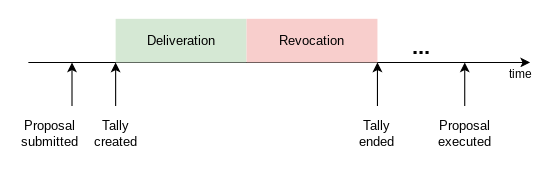
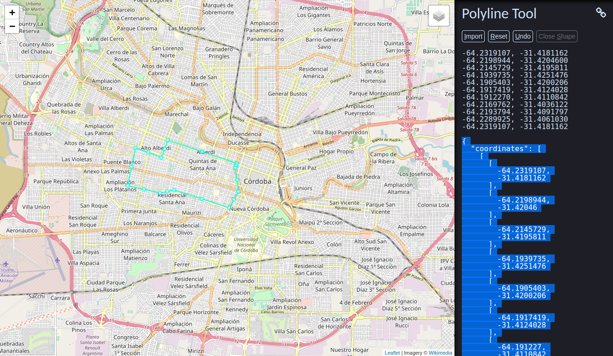

 Humanity Unchained DAO

<!-- TOC -->

- [Description](#description)
- [Usage](#usage)
    - [Voting](#voting)
    - [Banning members](#banning-members)
    - [Token](#token)
    - [Emblems](#emblems)
- [FAQ](#faq)
    - [How is the HUD token distributed?](#how-is-the-hud-token-distributed)
    - [How to claim my referral tokens?](#how-to-claim-my-referral-tokens)
    - [How to add HUD token to Metamask?](#how-to-add-hud-token-to-metamask)
    - [How to submit a proposal for a vote?](#how-to-submit-a-proposal-for-a-vote)
    - [How to create an emblem?](#how-to-create-an-emblem)
    - [How to create a cluster?](#how-to-create-a-cluster)
    - [How do a I change my profile?](#how-do-a-i-change-my-profile)
    - [How to vote in Snapshot?](#how-to-vote-in-snapshot)
    - [How to add my emblem DAO in Snapshot.org?](#how-to-add-my-emblem-dao-in-snapshotorg)
    - [How to claim a seat?](#how-to-claim-a-seat)
- [Community](#community)
- [License](#license)
- [Disclaimers](#disclaimers)

<!-- /TOC -->

# Description

This app is the reference implementation of [Humanity Unchained DAO (HUD)](https://humanityunchained.org), a [Decentralized Autonomous Organization](https://en.wikipedia.org/wiki/Decentralized_autonomous_organization) with the goal to build a new civilization based on the principle of unconditional respect for the consent of human beings. This app implements the specifications given by the [Constitution](../constitution/README.md) and the [Additional Rules](../README.md).

# Usage

A web frontend is deployed on:

|||
| --- | --- |
| Production    | https://app.humanityunchained.org |
| Test/Sandbox  | https://test1.humanityunchained.org  |

To use it, you need a Web3 wallet such as [Metamask](https://metamask.io) installed on your browser.

HUD's smart contracts are deployed on the **Polygon** chain.

## Voting

The app implements a [semi-direct democracy](https://en.wikipedia.org/wiki/Semi-direct_democracy) algorithm by which the members of the DAO can, either through a direct or a delegated vote, collectively interact with any smart contract. HUD's voting workflow consists of the following steps:

**Step 1: A proposal is submitted**

Any member of the DAO can submit a proposal to the DAO. This is done by submitting a transaction proposal to HUD's `Wallet` contract. After that, members of the DAO can cast their votes on the proposal.

**Step 2: The community votes on the transaction proposal**

The DAO has a limited number of *seats*, which are occupied by the delegates who have been appointed by the largest number of members. The votes from delegates without a seat are not counted. The *voting power* of a seated delegate is proportional to the number of members that appointed him/her. For simplicity, the rule *1-member-1-vote* is applied.

The voting process is divided into two phases: *deliberation* and *revocation*. Delegates cannot cast votes during the revocation period, **only members**. This guarantees members the chance to push back any decision from the delegates.

A delegate vote is always *positive*, that is, a no-vote is equivalent to vote against, whereas a member vote can be either *positive* or *negative*. The *negative* vote allows members to reject a proposal that was approved by the delegates during the *deliberation* phase.

Let us take the following example of a voting:

|||
--- | --- |
|Members|c1,c2,c3,c4,c5,c6,c7,c8
|Delegates|d1,d2,d3
|Total member population|8
|Number of seats|2
|Delegate appointments|d1:c1,c2,c3,c4; d2:c4,c5; d3:c8
|Delegates with seat|d1,d2
|Delegate votes|d1,d2
|Member votes|c1,c2,c4,c4,c5:nay; c6,c7,c8:yay
|Voting threshold|50%

The number of delegated votes is:

`4 (d1) + 2 (d2) = 6 votes`

Since the total number of delegated votes compared to the member population surpasses the threshold, i.e. `6 / 8 > 50%`, the **delegate voting result** is *yay*.

Now, the numbers of member votes are:

`nay: 5 votes (c1,c2,c4,c4,c5)`

`yay: 3 votes (c6,c7,c8)`

Since the voting threshold has been surpassed (i.e. `5 / 8 > 50%`) and more members have voted *nay* than *yay* (i.e. `5 > 3`), then the **member voting result** is *nay*.

Since the member vote result always overrides the delegate vote result, the final voting result is *nay*, and therefore the proposal's final status will be `NotApproved`. If not enough members had voted *nay* to surpass the voting threshold, the proposal's final status would have been `Approved`.

After the tally is ended, the final counting of votes and the execution of the transaction proposal (if approved), has to be triggered externally via a call to the smart contract. Anyone, not only DAO members, can do that call. The elapsed time between the tally end time and final counting should be, in theory, short as there is an economic incentive in HUD tokens for anyone to call the contract accordingly.

Seated delegates may be paid a number of HUD tokens proportional to their *voting power*. This creates an incentive for delegates to compete for members’ trust.

Example:
|||
--- | --- |
|Number of members|10
|Number of delegates|3
|Number of seats|2
|Delegates with seat|A, B
|Number of appointments of delegate A|5
|Number of appointments of delegate B|3
|Number of appointments of delegate C|2
|Total delegation reward token rate|100 HUD/sec
|Delegate A reward|100*5/10 = 50 HUD/sec
|Delegate B reward|100*3/10 = 30 HUD/sec

**Step 3: The transaction is approved and executed**

If the final result of the voting is `Approved`, the transaction can now be executed. The `Assembly` contract implements an automatic pricing algorithm that pays an increasing number of HUD tokens over time to anyone willing to bear the transaction costs. The number of HUD is determined by the formula 2^(number of seconds passed since approval).

Example:
|||
--- | --- |
|Number of blocks passed since approval|30
|Average block duration|2 sec
|Number of seconds passed since approval|30*2 = 60 sec
|Reward|1.15292150460685E+018 ~= 1.15 HUD

## Token

There are 21 million HUD tokens. The DAO has full control of the tokens so that the community can, for example, vote to forcibly transfer or lock HUD.

The HUD token is mainly distributed through referrals between members. The number of tokens per referral decreases in a similar way to Bitcoin's block reward. As specified in the [Additional Rules](../README.md#distribution), HUD's reward halves every 200000 new referred members, starting with 50 HUD tokens to share between the referrer and the referred members, and ending when a total of 20 million HUD tokens have been rewarded.

The DAO owns the remaining 1 million tokens as a reserve. The DAO may use the reserve to pay for the services that the DAO needs to function or for any other purpose the DAO approves so. These services are:

1. *Delegation*: Delegates are rewarded with HUD for casting their vote on transation proposals. Anyone can become a delegate. Members can optionally choose what delegate they trust their vote to, but members can **always** cast their own vote which overrides the delegates' or appoint another delegate at anytime.

2. *Execution*: The proposals are blockchain transactions to be executed if approved by the DAO. The DAO rewards with HUD to whoever is willing to pay the gas fees needed for the transaction's execution.

## Emblems

Coming soon.

# FAQ

## How is the HUD token distributed?
See [token](#token).

## How to claim my referral tokens?
Coming soon.

## How to add HUD token to Metamask?
Coming soon.

## How to submit a proposal for a vote?

Coming soon.

## How to create an emblem?

Coming soon.

## How to create a cluster?

The cluster coordinates need to be introduced in the correct format. Follow these steps:

1. Go to [Polyline Tool](https://www.keene.edu/campus/maps/tool)

2. Draw your cluster's geometry in the map. Do not forget to click on the "Close Shape" when you are done drawing.

3. Copy the coordinates and paste them in the text area of the HUD app.

## How do a I change my profile?

Coming soon.

## How to vote in Snapshot?

Coming soon.

## How to add my emblem DAO in Snapshot.org?

Coming soon.

## How to claim a seat?

Coming soon.

## How to integrate my DAO with HUD?

Coming soon.

# Community

See [here](../README.md#management-of-off-chain-services)

# License

Humanity Unchained DAO is released under the [MIT License](LICENSE).

# Disclaimers

1. This project is for experimental purposes only. In no event shall the creators or members of the DAO be liable for any claim, damages or other liability, whether in an action of contract, tort or otherwise, arising from, our of or in connection with this project.

2. Nothing contained in this project should be considered financial or legal advice.

3. HUD token holders must be warned that their HUD tokens can be locked or confiscated if the DAO approves so through a democratic voting.
